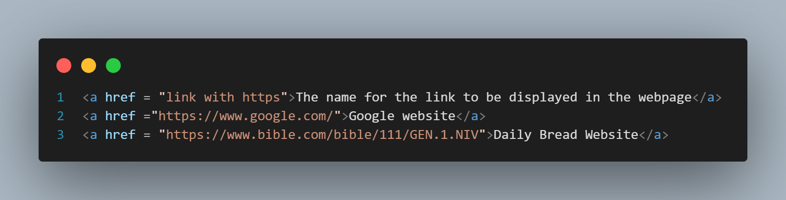

The tags are the blocks of text that are used to type something in the website
 
There are more than 300 different types of tags in html
  
tag without the / is the beginning tag and the tag with the / is the ending tag.
 
The tags are the building block of a html program

Nested tag
 
we can use one tag in another tag and infinete times but we should close the inner most tag first then we have to close the outermost tag
 
Anchor tab: This is the tag that allows to add external links or the redirecting links that we should incldue in our website 
 
Syntax for the anchor tabs 

 
div: this is known as division and then this by itself has no meaning like a cardboard box and then same like cardboard box its defined by what it has in it.
 
'' This is the tag that is like a ziplock. The span is same as div but smaller one
 
Syntax of the span
 

using this span we can change the style of the single word (usign css)
as shown in the image
  